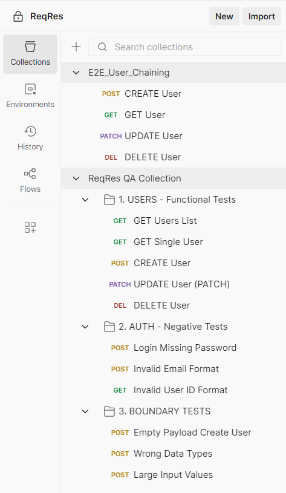
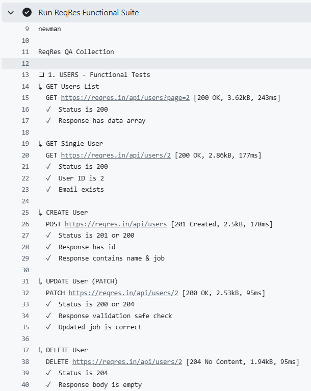
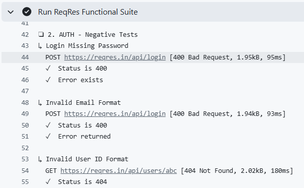
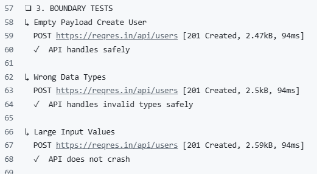
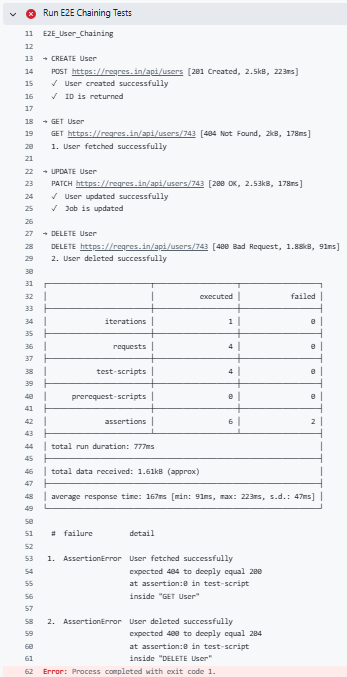
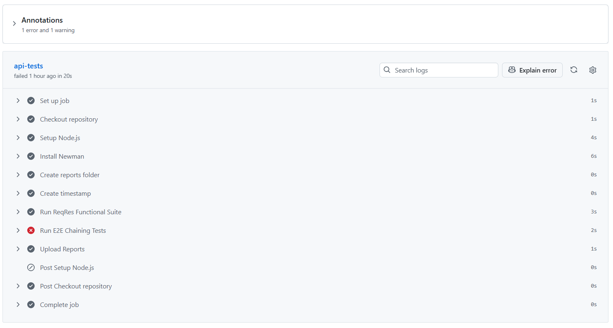
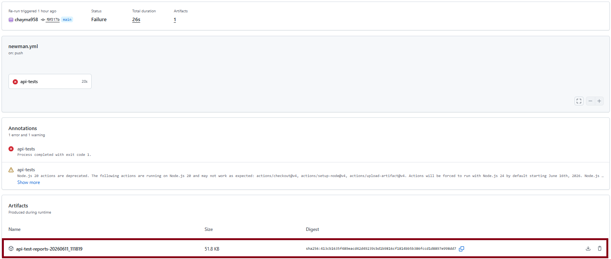
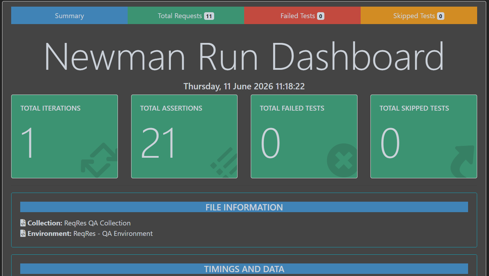
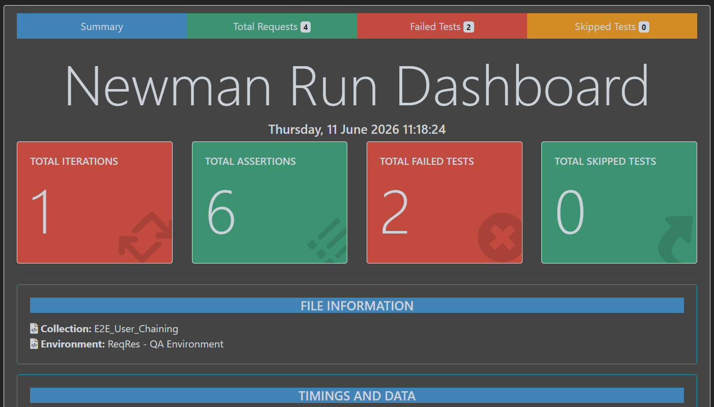

# ReqRes API Testing Project

## Overview

This project demonstrates API testing using **Postman**, **Newman**, and **GitHub Actions CI/CD**.

The project includes:

* Functional API Testing
* Negative Testing
* Boundary Testing
* End-to-End (E2E) API Chaining
* Automated Newman Execution
* HTML Report Generation
* CI/CD Integration with GitHub Actions
* Test Case Documentation

---

## Project Structure

```text
├── collections/
│   ├── ReqRes_Collection.json
│   └── E2E_User_Chaining.json
│
├── environments/
│   └── QA_Environment.json
│
├── reports/
│   └── Generated Newman HTML Reports
│
├── test-cases/
│   └── API_Test_Cases.md
│
└── .github/workflows/
    └── api-tests.yml
```

collections in postman : 



---

## Environment Setup

Before running the collections, create a free account on [ReqRes](https://reqres.in) and obtain your API key.

Update `environments/QA_Environment.json` with your own API key:

```json
{
  "key": "api_key",
  "value": "your_api_key_here"
}
```

For security reasons, real API keys are not included in this repository.

---

## Functional Testing

The main collection validates core CRUD operations:

* Get Users List
* Get Single User
* Create User
* Update User
* Delete User

Assertions verify:

* Status codes
* Response structure
* Required fields
* Returned data values



---

## Negative Testing

Negative scenarios verify API behavior when invalid data is provided.

Examples:

* Login without password
* Invalid email format
* Invalid user ID format

Expected error responses are validated through assertions.



---

## Boundary Testing

Boundary tests verify system stability when receiving unusual input.

Examples:

* Empty request body
* Invalid data types
* Large input values

These tests ensure the API handles edge cases safely without crashing.



---

## End-to-End (E2E) User Chaining

The E2E collection demonstrates API chaining by passing data between requests.

Flow:

1. Create User
2. Save returned user ID
3. Get User using saved ID
4. Update User
5. Delete User

This simulates a complete user lifecycle workflow.

---

## Known E2E Failures (Intentional Demonstration)

The ReqRes API does not persist newly created users.

After creating a user, ReqRes returns an ID such as:

```json
{
  "id": "743"
}
```

However, that user does not actually exist in the backend database.

As a result:

### GET User

Expected:

```text
200 OK
```

Actual:

```text
404 Not Found
```

### DELETE User

Expected:

```text
204 No Content
```

Actual:

```text
400 Bad Request
```



These failing assertions are intentionally kept in the project to demonstrate:

* Failure detection
* Assertion reporting
* CI/CD pipeline failure handling
* HTML report generation for failed executions

This showcases how automated testing identifies defects and unexpected behavior.

---

## CI/CD Pipeline

GitHub Actions automatically executes tests on every push to the main branch.

Pipeline tasks:

1. Checkout repository
2. Install Node.js
3. Install Newman
4. Install Newman HTML Extra Reporter
5. Execute Postman collections
6. Generate HTML reports
7. Upload reports as workflow artifacts



---

## Reports

Newman HTML reports are generated automatically during CI execution.

Reports include:

* Executed requests
* Passed assertions
* Failed assertions
* Response details
* Execution statistics

Reports can be downloaded from the GitHub Actions Artifacts section.







---

## Tools Used

* Postman
* Newman
* Newman HTML Extra Reporter
* GitHub Actions
* ReqRes API

---

## Author

Chayma Boubaker

